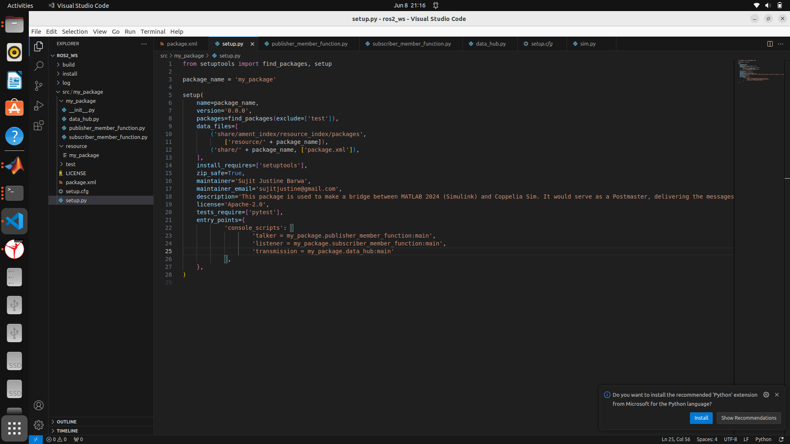
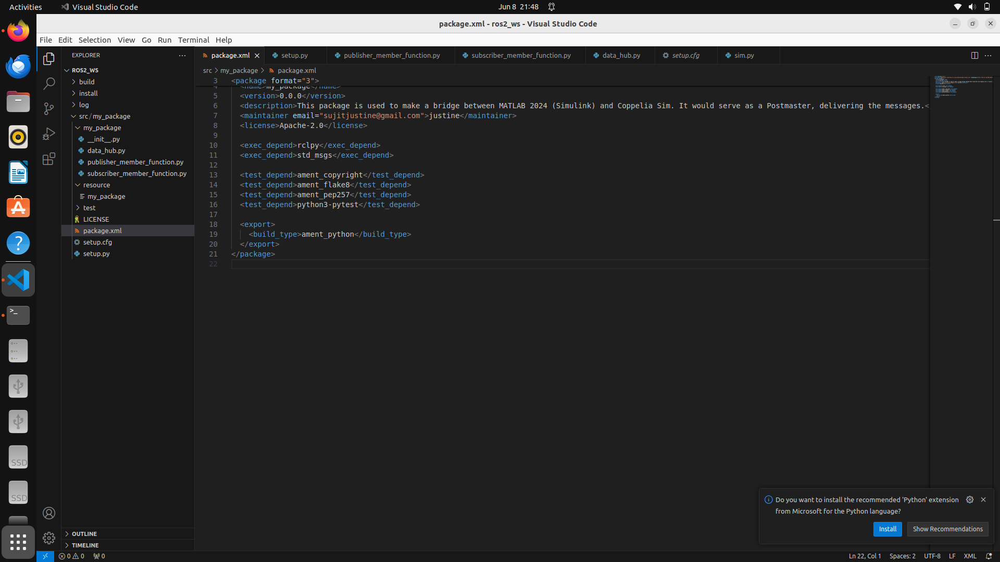

# Project Description
## Installing ROS2
1) Install ROS humble using the following [link](https://docs.ros.org/en/humble/Installation/Alternatives/Ubuntu-Development-Setup.html).
2) Source it :
```bash
source /opt/ros/humble/setup.bash
```
3) Make a basic publisher subscriber node using the help of this [link](https://docs.ros.org/en/humble/Tutorials/Beginner-Client-Libraries/Writing-A-Simple-Py-Publisher-And-Subscriber.html).
4) If you want to learn how to make workspace using colcon use this [link](https://docs.ros.org/en/humble/Tutorials/Beginner-Client-Libraries/Creating-A-Workspace/Creating-A-Workspace.html).
5) If you want to learn how to make package using colcon use this [link](https://docs.ros.org/en/humble/Tutorials/Beginner-Client-Libraries/Creating-Your-First-ROS2-Package.html).

## Building the ROS Workspace
7) Once the workspace is built, copy the data_hub.py in the src folder of your package.You can refer the folder structure by unzipping the ros2_ws.zip file.
8) Then, in setup.cfg add tranmission as shown below :
   
9) Add these lines in package.xml :
   ```bash
     <exec_depend>rclpy</exec_depend>
     <exec_depend>std_msgs</exec_depend>
   ```
   
   
10) Build the project using : 
   ```bash
     colcon build --packages-select my_package
   ```
   Note : my_package is my package's name.Also pip install coppeliasim_zmqremoteapi_client and pyzml for coppelia sim.

11) Source the project in ros2_ws folder :
   ```bash
     source install/setup.bash
   ```

## Start the simulation
12) Load model Robot_Sim1.ttt in coppelia sim and start the topics by running :
    ```bash
      ros2 run my_package transmission
    ```
    
13) Check the topic :
    ```bash
      ros2 topic list
    ```

13) Run the Simulink model.

# Updates and revisions
1) The left wheel joint and right wheel joint's dynamics are set to velocity control rather then free.
2) The file Visualization_with_python.py is introduced in the my_package folder inside the src of the ros2_ws.The Robot_Sim1.ttt is loaded in Coppelia Sim and this file can be independently run to visualize the left and right wheel speed,the TOF readings and Robot's Orientation.Note that this is not a part of ros build.It was made to verify the coppelia class used in data_hub, which transmits the data in ros.
