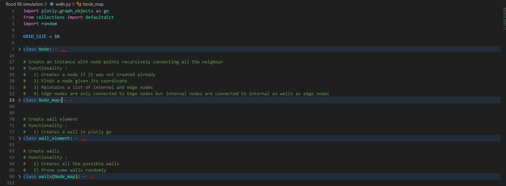

# Simulation for flood fill algorithm

In this section, a python code is presented where a web app has been designed which simulates the maze and the working of the flood fill algorithm.The dash library is used.

## **<u>How to use this section of the code</u>**
1. Create a new environment
2. Run pip install -r requirements.txt
3. Run app.py

## **The Architect of the code**

## **Structure of walls.py**

1. Class Node: 
    - This class is for representing a point in space. 
    - A unique id is assigned to every node. 
    
3. Class Node_map: 
   - This class generates the unique node points and set the neighbouring points(East,West,North,South). 
   - Two seperate nodes_lists are maintained  
        - all_internal_nodes  
        - all_edge_nodes  
        (Note : The edge nodes are note allow to keep the internal nodes as there children(neighour) while internal nodes can keep edge nodes as there children(neighour).This is done so that in furthur while in the development freedom could be given to the internal nodes.) 
   - A functionality is provide where you can find the node via its x and y coordinate. 
    
4. Class wall_element: 
   - It stores two nodes and also what color it should be when plotted. 

5. Class walls: 
   - It create node map and generate all the possible walls. 
   - The functionality then prune_walls() performs the following operation: 
      - Makes the goal walls. 
      - Prune internal walls randomly. 
      - Set the neighbour of the each wall and ensures that there are no closed loop forming(function cyclic_check() removes the cyclic walls using DFS algorithm).  
      - Makes the outer walls. 
      - Sends the walls to App.py for plotting. 
        
## **Structure of App.py** 
 
   - The app.layout is used to structure the placement of the graph object,text,buttons,etc 
   - The callback function is used update the graph object in the web app. 
    
## **Extended_Function.py** 
   - This function serves as a event manager function for the web app. 

## **Mouse**  
   - Path tracking is capability added. 
